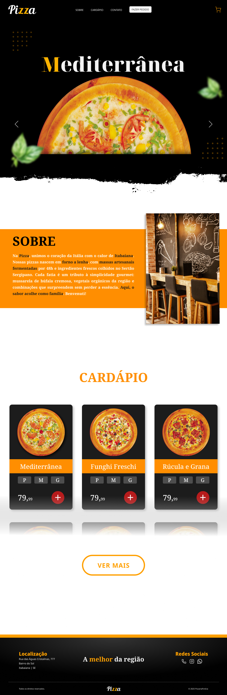
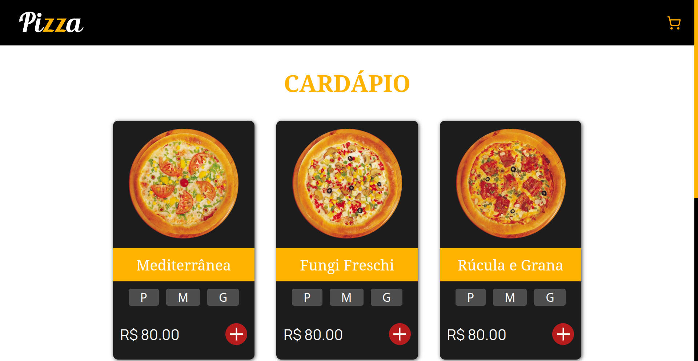

📄 Read in [English](./README.md)
<hr>

# 🍕 Cardápio de Pizzaria

Projeto simples e interativo de cardápio de pizzaria, desenvolvido com foco em praticar **HTML**, **CSS** e **JavaScript** (com `async/await` e consumo de dados via `JSON`).  
Este componente também fará parte de um futuro site completo feito com **React**.  
Atualmente, apenas o design completo do site foi finalizado.


<details>
  <summary>Clique para ver o design completo do site</summary>

  <br>

  

</details>

## Preview



## 🔥 Demonstração

[🔗 Veja o projeto online](https://pizzaria-menu.vercel.app/)  

## 📋 Funcionalidades

- Listagem de pizzas com nome, imagem e preço
- Seleção de tamanho e quantidade
- Adição ao carrinho
- Cálculo automático de subtotal, frete e total
- Layout responsivo para mobile e desktop

## 🚀 Tecnologias utilizadas

- HTML5
- CSS3
- JavaScript
- JSON (para simular base de dados)

## 💻 Como rodar localmente

1. Clone o repositório:
   ```bash
   git clone https://github.com/seuusuario/cardapio-pizzaria.git
   cd cardapio-pizzaria
