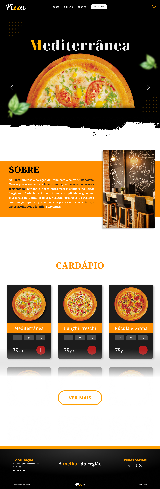
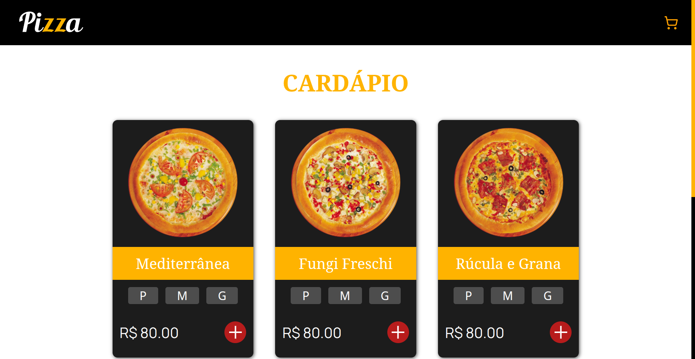

📄 Leia em [Português](./README-pt.md)
<hr>

# 🍕 Pizzeria Menu

A simple and interactive pizzeria menu project, developed with a focus on practicing **HTML**, **CSS**, and **JavaScript** (using `async/await` and data fetching via `JSON`).  
This component will also be part of a future complete website built with **React**.  
Currently, only the full site design has been completed.

<details>
  <summary>Click to view the full site design</summary>

  <br>

  

</details>

## Preview



## 🔥 Demo

[🔗 Check the project online](https://seu-portfolio.vercel.app)  

## 📋 Features

- Listing of pizzas with name, image, and price
- Selection of size and quantity
- Add to cart
- Automatic calculation of subtotal, shipping, and total
- Responsive layout for mobile and desktop

## 🚀 Technologies used

- HTML5
- CSS3
- JavaScript
- JSON (to simulate a database)

## 💻 How to run locally

1. Clone the repository:
   ```bash
   git clone https://github.com/seuusuario/cardapio-pizzaria.git
   cd cardapio-pizzaria
